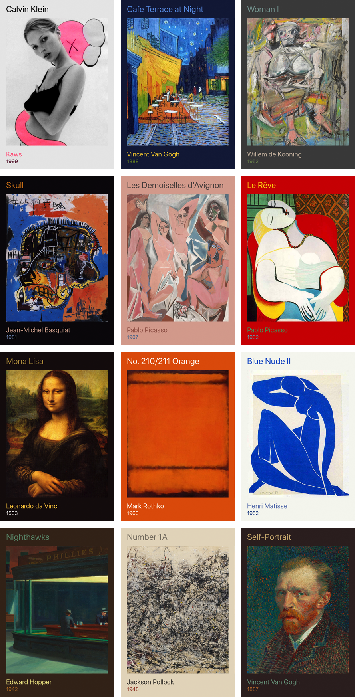

# UIImageColors

iTunes style color fetcher for UIImage. It fetches the most dominant and prominent colors.



## Installation

You can either directly copy [UIImageColors.swift](Sources/UIImageColors.swift) into your project *or* you can use CocoaPods: [UIImageColors](https://cocoapods.org/pods/UIImageColors).

## Example

Asynchronous example:

```swift
let image = UIImage(named: "yeezus.png")

image.getColors { colors in
  backgroundView.backgroundColor = colors.background
  mainLabel.textColor = colors.primary
  secondaryLabel.textColor = colors.secondary
  detailLabel.textColor = colors.detail
}
```

Synchronous example:

```swift
let colors = UIImage(named: "yeezus.png").getColors()

backgroundView.backgroundColor = colors.background
mainLabel.textColor = colors.primary
secondaryLabel.textColor = colors.secondary
detailLabel.textColor = colors.detail
```

## UIImage Methods

```swift
getColors() -> UIImageColors
```

```swift
getColors(quality: UIImageColorsQuality) -> UIImageColors
```

```swift
getColors(_ completion: (UIImageColors) -> Void) -> Void
```

```swift
getColors(quality: UIImageColorsQuality, _ completion: (UIImageColors) -> Void) -> Void
```

## UIImageColors Objects

`UIImageColors` is struct that contains four different `UIColor` variables.

```swift
public struct UIImageColors {
    public var background: UIColor!
    public var primary: UIColor!
    public var secondary: UIColor!
    public var detail: UIColor!
}
```

`UIImageColorsQuality` is a enum with four different qualities. The qualities refer to how much the original image is scaled down. `Lowest` implies smaller size and faster performance at the cost of quality colors. `High` implies larger size with slower performance with good colors. `Highest` implies no downscaling and very good colors, but it is very slow.

The default is set to `high`.

```swift
public enum UIImageColorsQuality: CGFloat {
    case lowest = 50 // 50px
    case low = 100 // 100px
    case high = 250 // 250px
    case highest = 0 // No scale
}
```

## License

The [license](https://github.com/jathu/UIImageColors/blob/master/LICENSE) is provided in the project folder. This is based on Panic's [OS X ColorArt](https://github.com/panicinc/ColorArt/#license).

------
June 2015 - Toronto