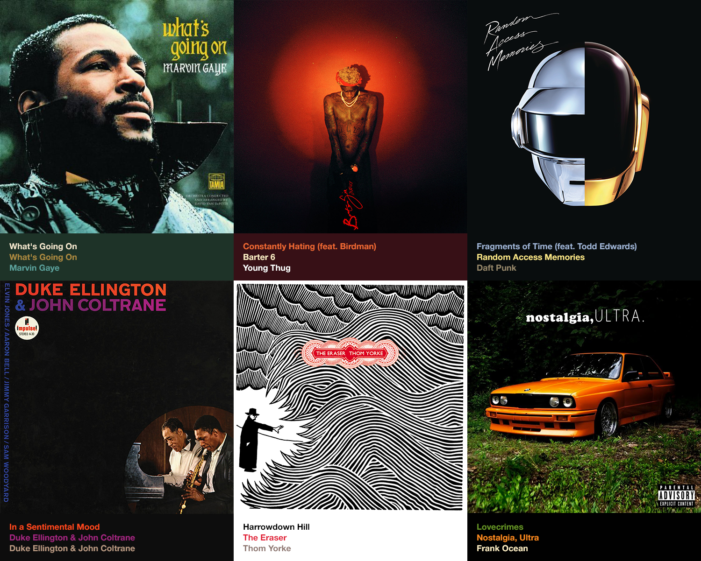

# UIImageColors

iTunes 11 style color fetcher for UIImage. This is an *almost* identical port of [Panic's OS X ColorArt](https://github.com/panicinc/ColorArt/) for iOS Swift.

In other words, it fetches the most dominant and prominent colors.



# Documentation

This is pretty simple to use:

```Swift
let image = UIImage(named: "hello.png")
let colors = image.getColors()

backgroundView.backgroundColor = colors.backgroundColor
mainLabel.textColor = colors.primaryColor
secondaryLabel.textColor = colors.secondaryColor
detailLabel.textColor = colors.detailColor
```

## UIImage Methods

- **getColors(scaleDownSize: CGSize) -> UIImageColors**

Get an UIImageColors struct from the image. Use smaller sizes for better performance at the cost of quality colors. Use larger sizes for better color sampling and quality at the cost of performance. 

- **getColors() -> UIImageColors**

Get an UIImageColors struct from the image. The default image scale down is 250px width, and the aspect ratio height.

- **resize(newSize: CGSize) -> UIImage**

Resize your image.

## UIImageColors

UIImageColors simply contain four different colors.

- **backgroundColor -> UIColor**
- **primaryColor -> UIColor**
- **secondaryColor -> UIColor**
- **detailColor -> UIColor**

## UIColor Methods

As a result of testing colors for certain properties, UIColor get's some cool extensions. The functions are self-explanatory.

- **isDarkColor -> Bool**
- **isBlackOrWhite -> Bool**
- **isDistinct(compareColor: UIColor) -> Bool**
- **colorWithMinimumSaturation(minSaturation: CGFloat) -> UIColor**
- **isContrastingColor(compareColor: UIColor) -> Bool**

## License

Feel free to do whatever you want. Please include the original header in any modifications or redistributions.

------
June 2015 - Toronto
